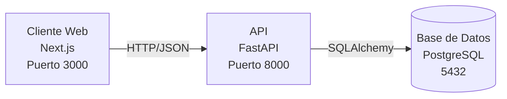

# 🏗️ Diagrama de Arquitectura

## Arquitectura Cliente-Servidor

```mermaid
flowchart LR
    Cliente[Cliente Web\nNext.js\nPuerto 3000]
    API[API\nFastAPI\nPuerto 8000]
    DB[(Base de Datos\nPostgreSQL\n5432)]
    
    Cliente -->|HTTP/JSON| API
    API -->|SQLAlchemy| DB
```