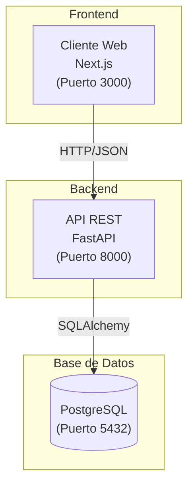

# 🏗️ Diagrama de Arquitectura

## Arquitectura Cliente-Servidor

## Flujo de Datos

1. El usuario interactúa con la interfaz en **Next.js** (Puerto 3000)
2. Next.js envía peticiones HTTP/JSON a la **API FastAPI** (Puerto 8000)
3. FastAPI procesa la solicitud y consulta la **Base de Datos PostgreSQL** (Puerto 5432)
4. PostgreSQL devuelve los datos a FastAPI
5. FastAPI responde con JSON a Next.js
6. Next.js renderiza la información para el usuario

## ¿Por qué esta arquitectura?

- **Separación de responsabilidades**: Cada capa tiene una función clara
- **Escalabilidad**: Se puede escalar cada componente independientemente
- **Mantenibilidad**: Cambios en una capa no afectan a las otras